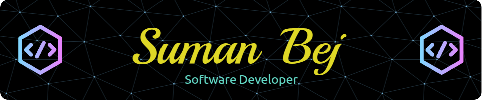

<h1 align="center">Hi 👋, I'm Suman Bej</h1>
<h3 align="center">Software Developer | Backend & Full-Stack Enthusiast</h3>

I enjoy building scalable systems, solving algorithmic problems,  
and strengthening my engineering fundamentals every day.

---

## 🚀 About Me
- 🌱 Currently learning **Java, Spring Boot, React.js, Next.js**
- 🧠 Focused on **DSA, System Design & Backend Engineering**
- 👨‍💻 Projects & work: **[Portfolio](https://sumanbej-portfolio.netlify.app/)**
- 💬 Ask me about **Java, JavaScript, DSA , LLD, HLD**
- 📫 Reach me at **bejsuman29@gmail.com**

---

## 🌐 Connect With Me

  
  

---

## 🛠️ Tech Stack

### 💻 Languages

  
  
  
  

### ⚙️ Backend & Databases

  
  
  
  
  
  
  

### 🎨 Frontend

  
  
  
  
  
  

### ☁️ DevOps & Tools

  
  
  
  
  
  

---

## 🏆 Highlights
- 🥇 **LeetCode 365 Days Badge** — consistency & discipline
- 📈 Actively preparing for **SDE-1 / SDE-2 roles**
- 🧩 Strong problem-solving mindset with real-world focus

---

⭐️ *If you like my work, consider starring my repositories — it keeps me motivated to build more!*
